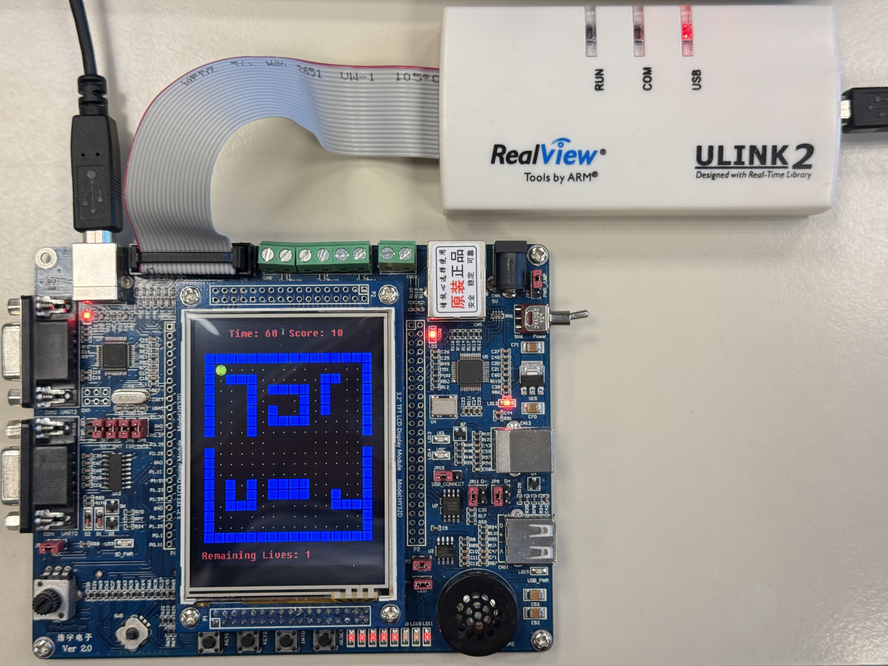
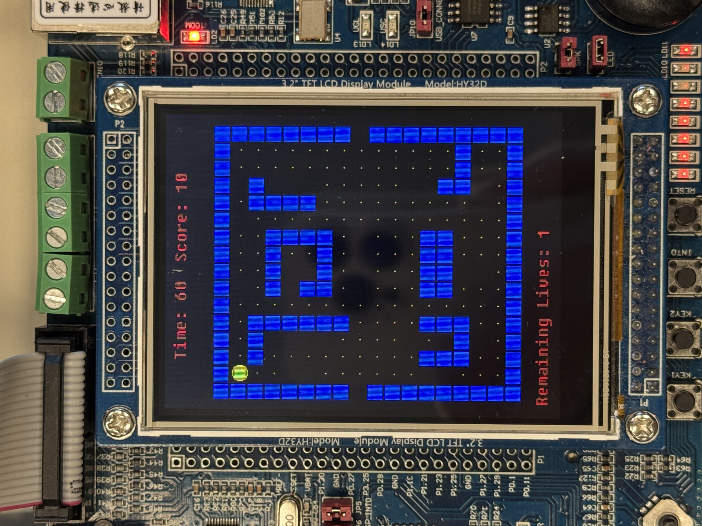
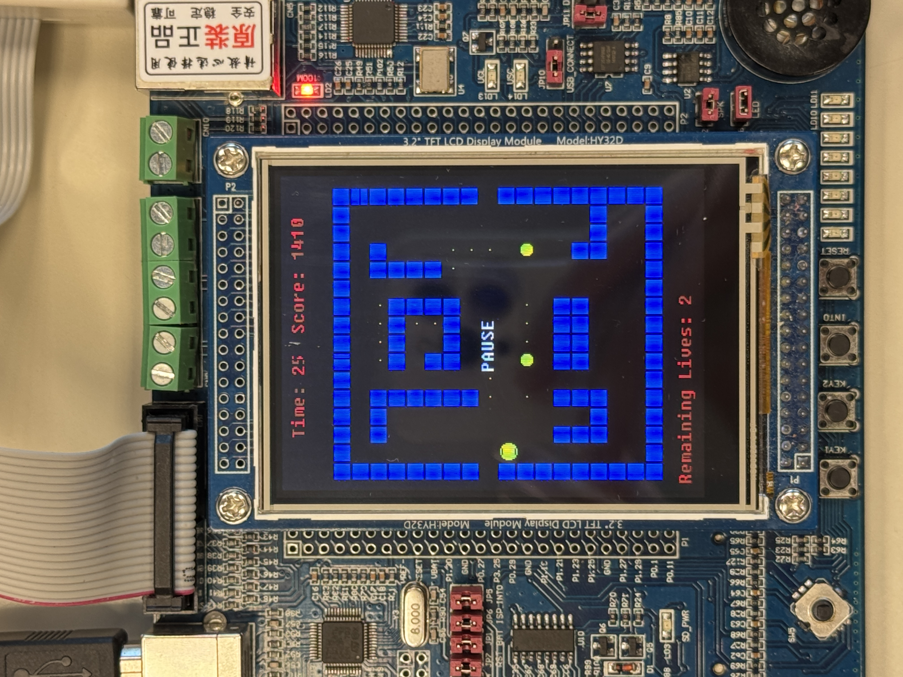
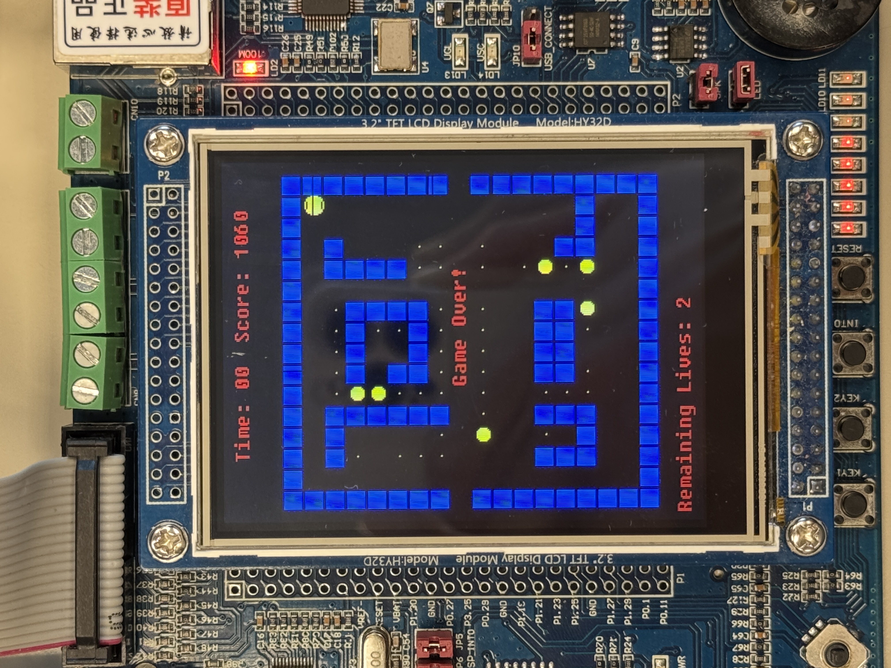
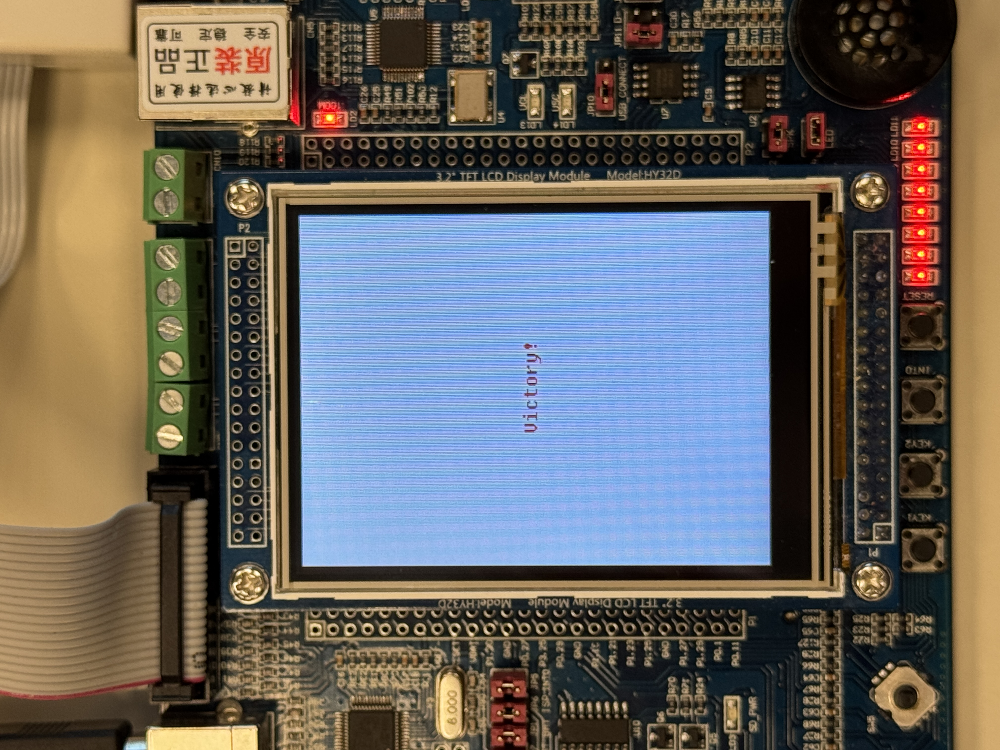

# Pac-Man Game with Music Feature

This is a Pac-Man-inspired game implemented on an LPC1768 microcontroller. It features:
- Real-time player interaction via a joystick.
- Smooth gameplay, including countdown timers, pills & power pills, and a scoring system.

The project demonstrates embedded systems programming by utilizing timers, interrupts, and hardware peripherals for a fun and interactive game.

---

## Screenshots

### 1. Overview

  

### 2. Start Screen

  

### 3. Pause Screen

  

### 4. Game Over Screen

  

### 5. Victory Screen

  

---

## How to Play

1. Build and load the code onto the LPC1768 microcontroller.
2. Use the joystick to control Pac-Man's movement.
3. Navigate the maze, collect power pills, and avoid obstacles.
4. normal pills have 10 point, and power pills have 50 points
5. Collect all the pills in 60sec to win.
6. you can use INT0 to pause/resume.
7. fell free to use portals that can help your PAC-MAN.

---